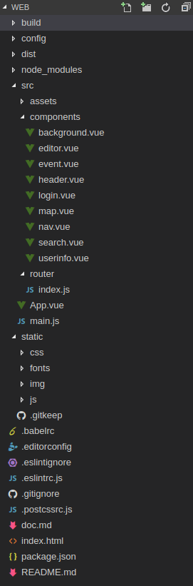

# 前端

我们的网站是一个SPF应用，采用组件化的开发方式，页面内所有的元素均为组件

前端框架Vue.js非常适合组件化开发SPF应用，于是我们采用的技术框架就有了

> - Vue.js
> - Vuex
> - Vue-router
> - webpack

Vue.js为核心，Vue只关心视图层，并将视图与数据进行双向绑定，核心思想是通过数据的变化来改变视图，不直接进行DOM操作

Vuex 是一个专为Vue.js应用程序开发的状态管理模式。它采用集中式存储管理应用的所有组件的状态，并以相应的规则保证状态以一种可预测的方式发生变化

Vue-router是一个页面路由管理工具，使用它可以很轻松的组合与管理页面组件，我们需要做的是，将组件映射到路由上，然后告诉路由在哪里渲染这些组件

webpack是一个模块加载器兼打包工具，它可以将html,js,css甚至图片等等都作为模块来进行处理，转化为CommonJS形式，我们的项目使用webpack打包，使用Vue.js官方提供的vue-loader来加载.vue模块文件

## 结构设计

项目目录如下：

包含关系如下：

- background
    - nav
        - login
        - search
    - map
    - editor
    - userinfo
    - event
        - header

background为根页面，根页面包含了nav editor userinfo event四个组件

其中userinfo与event组件默认隐藏，当用户尝试显示个人信息或者查看事件的时候显示在最顶层

background根据vue-router的配置在map与editor中切换

当用户访问'/'路径时显示nav与map，访问'/edit'路径时显示nav与editor

## 开发过程

1. 环境搭建
        
    #使用npm 安装

     `
     npm install vue vue-router vuex --save
     `

     #使用vue-cli脚手架工具安装

     `
     npm install vue-cli --save
    `

    `
    vue init webpack webgis
    `

2. 进入目录

    `
    cd webgis
    `
3. 安装依赖并运行

    `
    npm install
    `

    `
    npm run dev
    `

    会自动打开浏览器访问localhost:8080端口访问项目，并支持热重载，可自行在config/index.js文件中修改默认端口

4. 发布

    `
    npm run build
    `

    默认生成在根目录下的dist文件夹，可自行在config/index.js文件中修改生成路径

    